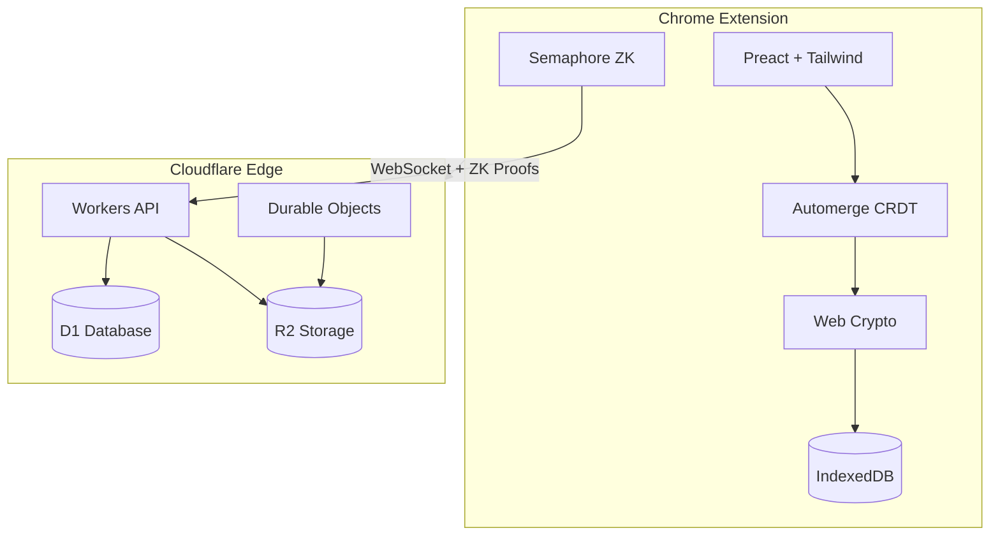

# ZKKB - Zero-Knowledge Kanban Board

End-to-end encrypted kanban board with zero-knowledge membership proofs.

## Features

- **End-to-End Encryption**: All board content encrypted client-side with AES-256-GCM
- **Zero-Knowledge Access**: Server cannot identify who accesses boards (Semaphore ZK proofs)
- **Real-time Collaboration**: Automerge CRDT for conflict-free sync
- **No Passwords**: 24-word recovery phrase (BIP39)
- **Chrome Extension**: Side panel UI with Preact + Tailwind

## Quick Start

```bash
# Install dependencies
npm install

# Development build (watch mode)
npm run dev

# Production build
npm run build

# Run tests
npm test
```

Load the extension in Chrome:
1. Go to `chrome://extensions`
2. Enable "Developer mode"
3. Click "Load unpacked"
4. Select the `dist/` folder

## Architecture



## Free vs Pro

| Feature | Free | Pro |
|---------|------|-----|
| Local boards | Unlimited | Unlimited |
| E2EE encryption | Yes | Yes |
| Recovery phrase | Yes | Yes |
| Cloud sync | - | Yes |
| Real-time collaboration | - | Yes |
| Board sharing | - | Yes |
| Attachment storage | - | Yes |
| Priority support | - | Yes |

## Documentation

- [Product Requirements](docs/PRD.md)
- [Architecture Decision Records](docs/adr/)
- [Implementation Plans](docs/plans/)

## Tech Stack

| Layer | Technology |
|-------|------------|
| Platform | Chrome Extension (Manifest V3) |
| Frontend | Preact, Tailwind CSS, Vite |
| CRDT | Automerge |
| Encryption | Web Crypto API, AES-256-GCM, X25519 |
| ZK Proofs | Semaphore Protocol |
| Backend | Cloudflare Workers, D1, R2, Durable Objects |

## License

MIT License for core functionality. Commercial license required for cloud sync features in production. See [LICENSE](LICENSE) for details.
