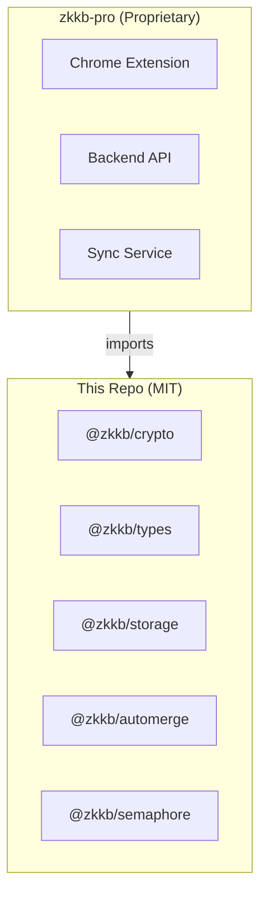

# ZKKB - Zero-Knowledge Kanban Board

Open source cryptographic libraries for building end-to-end encrypted applications with zero-knowledge proofs.

## Packages

| Package | Description | npm |
|---------|-------------|-----|
| [@zkkb/crypto](packages/crypto) | E2EE primitives (BIP39, AES-256-GCM, X25519) | [](https://www.npmjs.com/package/@zkkb/crypto) |
| [@zkkb/types](packages/types) | TypeScript type definitions | [](https://www.npmjs.com/package/@zkkb/types) |
| [@zkkb/storage](packages/storage) | IndexedDB persistence layer | [](https://www.npmjs.com/package/@zkkb/storage) |
| [@zkkb/automerge](packages/automerge) | CRDT operations for boards | [](https://www.npmjs.com/package/@zkkb/automerge) |
| [@zkkb/semaphore](packages/semaphore) | Zero-knowledge proof integration | [](https://www.npmjs.com/package/@zkkb/semaphore) |

## Installation

```bash
# Individual packages
npm install @zkkb/crypto
npm install @zkkb/semaphore

# Or all packages
npm install @zkkb/crypto @zkkb/types @zkkb/storage @zkkb/automerge @zkkb/semaphore
```

## Quick Start

### Recovery Phrase & Key Derivation

```typescript
import { generatePhrase, phraseToSeed, deriveKeys } from '@zkkb/crypto'

// Generate 24-word recovery phrase
const phrase = generatePhrase()
console.log(phrase) // "abandon ability able ... zone zoo"

// Derive keys from phrase
const seed = phraseToSeed(phrase)
const { publicKey, privateKey } = deriveKeys(seed)
```

### Encryption

```typescript
import { generateKey, encrypt, decrypt } from '@zkkb/crypto'

const key = await generateKey()
const plaintext = new TextEncoder().encode('Secret data')

const { ciphertext, iv } = await encrypt(key, plaintext)
const decrypted = await decrypt(key, ciphertext, iv)
```

### Zero-Knowledge Proofs

```typescript
import { identityFromSeed, createGroup, addMember, generateMembershipProof } from '@zkkb/semaphore'
import { phraseToSeed } from '@zkkb/crypto'

// Create identity from recovery phrase
const seed = phraseToSeed(phrase)
const identity = identityFromSeed(seed)

// Add to group
const group = createGroup()
addMember(group, identity.commitment)

// Generate ZK proof of membership
const proof = await generateMembershipProof(identity, group, 'access', 'board_123')
```

## Architecture



## Development

```bash
# Install pnpm if needed
npm install -g pnpm

# Install dependencies
pnpm install

# Build all packages
pnpm build

# Run tests
pnpm test
```

## Documentation

- [Product Requirements](docs/PRD.md)
- [Architecture Decisions](docs/adr/)
- [Freemium Model](docs/FREEMIUM.md)
- [Private Repo Setup](docs/PRIVATE_REPO_SETUP.md)

## License

All packages in this repository are licensed under the [MIT License](LICENSE).

The ZKKB application (extension + backend) is proprietary and maintained in a separate private repository. See [PRIVATE_REPO_SETUP.md](docs/PRIVATE_REPO_SETUP.md) for details.
