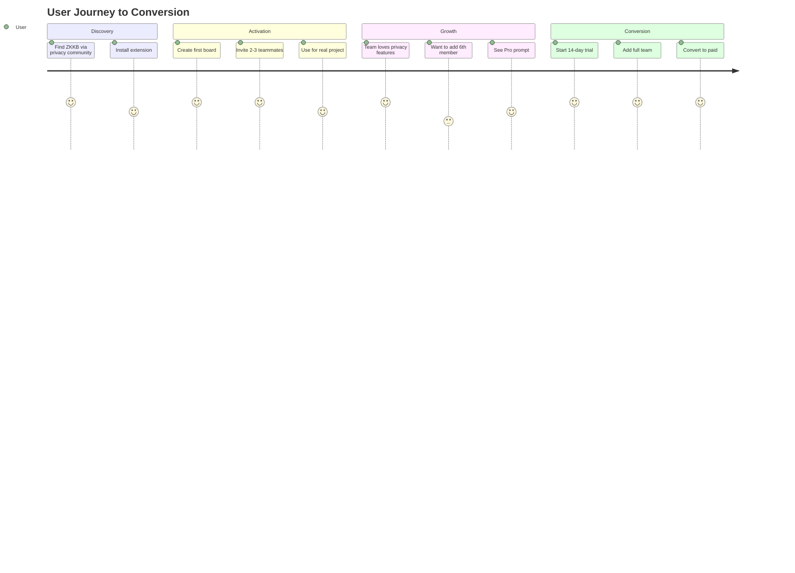

# ZKKB Freemium Model

## Overview

ZKKB uses a freemium model where **small team collaboration** is free, and larger teams or power users pay for Pro features. The core value proposition—end-to-end encrypted kanban with zero-knowledge proofs—is never paywalled.

## Positioning

> "End-to-end encrypted kanban for teams who value privacy. Free for teams up to 5."

## Feature Matrix

| Feature | Free | Pro |
|---------|------|-----|
| **Boards** | 3 | Unlimited |
| **Members per board** | 5 | Unlimited |
| **Total storage** | 100MB | 10GB |
| **E2EE + ZK anonymity** | ✅ | ✅ |
| **Real-time collaboration** | ✅ | ✅ |
| **Cloud sync** | ✅ | ✅ |
| **Attachments** | ✅ (10MB/file) | ✅ (100MB/file) |
| **Labels** | 6 colors | Unlimited + custom |
| **Due dates** | ✅ | ✅ |
| **Comments** | ✅ | ✅ |
| **Checklists** | ✅ | ✅ |
| **Board history** | 30 days | Unlimited |
| **Card templates** | ❌ | ✅ |
| **Recurring cards** | ❌ | ✅ |
| **Calendar view** | ❌ | ✅ |
| **Board export** | ❌ | ✅ |
| **Audit logs** | ❌ | ✅ |
| **SSO/SAML** | ❌ | ✅ |
| **Priority support** | ❌ | ✅ |

## Free Tier

**Target Users**: Small teams (2-5 people), startups, open source projects, activists, journalists

**Why It's Compelling**:
- Full E2EE and ZK anonymity—the core differentiator
- Real collaboration, not a crippled demo
- 5 members is enough for most small teams
- Unlimited boards means no artificial friction

**Infrastructure Cost**: ~$0.50-2/active team/month
- Durable Objects for WebSocket sync
- R2 storage (minimal at 500MB cap)
- D1 for metadata

**Why Free**:
- Small teams become advocates
- Privacy-conscious users are vocal evangelists
- Low marginal cost at scale
- Upgrade trigger is natural (team growth)

## Pro Tier

**Target Users**: Growing teams (6+), power users, organizations needing compliance

**Price Point**: $8/user/month or $72/user/year (25% annual discount)

**Upgrade Triggers**:
1. Team grows past 5 members
2. Need 4th board
3. Storage exceeds 100MB
4. Want calendar view for deadlines
5. Require audit logs for compliance
6. Need SSO integration

**Why Paid**:
- Larger teams = more storage, more sync traffic
- Power features require development investment
- Audit logs require additional infrastructure
- Support overhead scales with team size

## Enterprise Tier

**Target Users**: Large organizations, regulated industries

**Price Point**: Custom pricing (contact sales)

**Features** (in addition to Pro):
- Self-hosted deployment option
- Custom data retention policies
- Dedicated support engineer
- SLA guarantees (99.9% uptime)
- Volume discounts
- On-premise key management

## Conversion Strategy



### Key Insight

The upgrade trigger is **team growth**, not feature frustration. Users aren't blocked from doing their work—they're blocked from scaling. This feels fair and natural.

## Implementation

### Feature Gating

```typescript
// src/lib/features.ts
export interface TierLimits {
  maxBoards: number
  maxMembersPerBoard: number
  maxAttachmentSize: number      // bytes
  maxTotalStorage: number        // bytes
  historyDays: number | null     // null = unlimited
  labelColors: number | null     // null = unlimited
  hasCardTemplates: boolean
  hasRecurringCards: boolean
  hasCalendarView: boolean
  hasBoardExport: boolean
  hasAuditLogs: boolean
  hasSSO: boolean
}

export const FREE_TIER: TierLimits = {
  maxBoards: 3,
  maxMembersPerBoard: 5,
  maxAttachmentSize: 10 * 1024 * 1024,        // 10MB
  maxTotalStorage: 100 * 1024 * 1024,         // 100MB
  historyDays: 30,
  labelColors: 6,
  hasCardTemplates: false,
  hasRecurringCards: false,
  hasCalendarView: false,
  hasBoardExport: false,
  hasAuditLogs: false,
  hasSSO: false,
}

export const PRO_TIER: TierLimits = {
  maxBoards: Infinity,
  maxMembersPerBoard: Infinity,
  maxAttachmentSize: 100 * 1024 * 1024,       // 100MB
  maxTotalStorage: 10 * 1024 * 1024 * 1024,   // 10GB
  historyDays: null,                          // unlimited
  labelColors: null,                          // unlimited
  hasCardTemplates: true,
  hasRecurringCards: true,
  hasCalendarView: true,
  hasBoardExport: true,
  hasAuditLogs: true,
  hasSSO: true,
}
```

### Upgrade Prompts

Show upgrade prompts when:
- User tries to invite 6th member to a board
- Attachment exceeds 10MB
- Board storage approaches 100MB
- User clicks on Pro feature (calendar, templates, etc.)

**Prompt tone**: Helpful, not pushy
> "Your team is growing! Upgrade to Pro for unlimited members and more storage. Start a free 14-day trial."

**Never**:
- Block existing functionality
- Remove members from boards on downgrade
- Delete data when storage limit exceeded (warn only)
- Use dark patterns or guilt trips

### Downgrade Behavior

When a Pro user downgrades to Free:
- All boards remain accessible (read-only for excess members)
- Excess members can view but not edit until removed
- Pro features disabled but data preserved
- Storage soft-limit (warn, don't delete)
- History beyond 30 days hidden but not deleted

## Revenue Projections

| Scenario | Free Teams | Conversion | Pro Users | MRR |
|----------|------------|------------|-----------|-----|
| Launch (3mo) | 100 | 5% | 25 | $200 |
| Growth (12mo) | 2,000 | 8% | 800 | $6,400 |
| Scale (24mo) | 10,000 | 10% | 5,000 | $40,000 |

**Assumptions**:
- Average Pro team size: 5 users
- Privacy-focused users have higher conversion rates
- Word-of-mouth growth from satisfied free users
