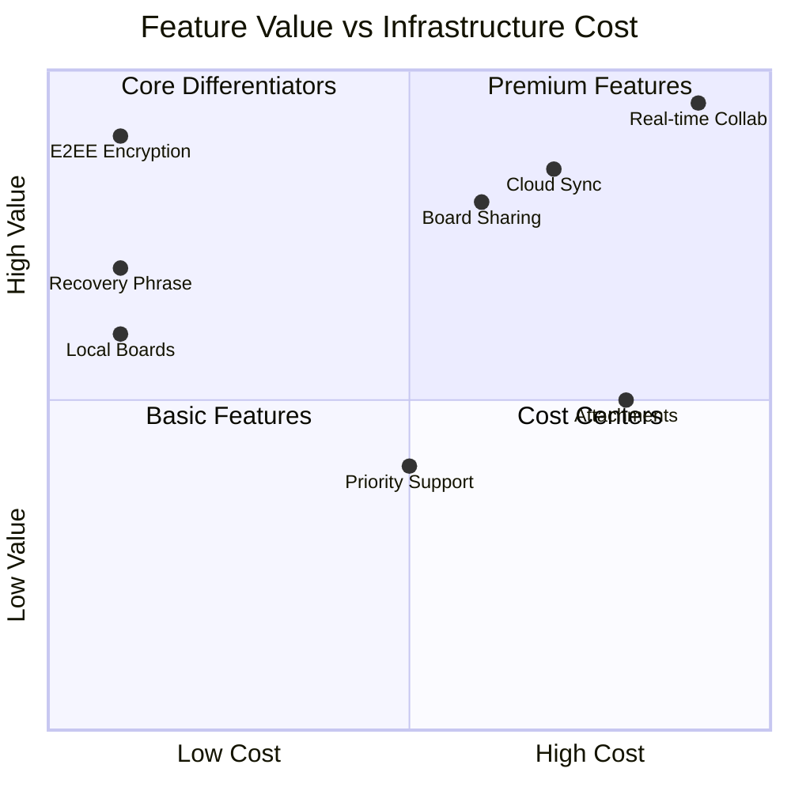
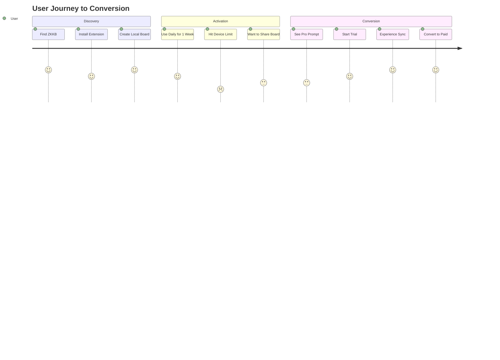

# ZKKB Freemium Model

## Overview

ZKKB uses a freemium model where core functionality is free and open source, while collaboration and cloud features require a paid subscription.

## Feature Matrix



## Free Tier

**Target Users**: Individuals, students, solo developers

**Features**:
- Unlimited local boards stored in browser IndexedDB
- Full E2EE encryption (AES-256-GCM)
- 24-word BIP39 recovery phrase
- Single-user experience
- Export boards as encrypted JSON backup
- No account required for local-only use

**Infrastructure Cost**: $0 (no server resources used)

**Why Free**:
- Zero marginal cost per user
- Builds trust in encryption claims (auditable)
- Grows user base for conversion

## Pro Tier

**Target Users**: Teams, small businesses, power users

**Price Point**: $8/user/month or $80/user/year

**Features** (in addition to Free):
- Real-time sync across devices
- Board sharing with ZK-verified members
- Collaborative editing with Automerge CRDT
- Cloud backup (encrypted R2 storage)
- Attachment storage (up to 10GB per board)
- Priority email support
- 99.9% uptime SLA

**Infrastructure Cost**: ~$5-15/month base + usage

**Why Paid**:
- Requires Cloudflare Durable Objects ($5/mo minimum)
- R2 storage costs scale with usage
- Support overhead
- Ongoing maintenance

## Enterprise Tier

**Target Users**: Large organizations, compliance-focused teams

**Price Point**: Custom pricing (contact sales)

**Features** (in addition to Pro):
- Self-hosted option
- SSO/SAML integration
- Audit logging
- Dedicated support
- Custom retention policies
- Volume discounts

## Conversion Strategy



### Trigger Points

1. **Multi-device**: User tries to access from second device
2. **Collaboration**: User clicks "Share Board" button
3. **Storage**: Local storage exceeds 50MB
4. **Backup**: User wants cloud backup assurance

### Friction Reduction

- 14-day free trial of Pro features
- No credit card for trial
- Seamless upgrade (boards auto-sync)
- Downgrade keeps local access

## Revenue Projections

| Scenario | Users | Conversion | MRR |
|----------|-------|------------|-----|
| Conservative | 1,000 | 2% | $160 |
| Moderate | 10,000 | 3% | $2,400 |
| Optimistic | 50,000 | 5% | $20,000 |

## Implementation Notes

### Feature Gating

```typescript
// src/lib/features.ts
export const FEATURES = {
  FREE: {
    localBoards: true,
    encryption: true,
    recoveryPhrase: true,
    maxLocalStorage: 50 * 1024 * 1024, // 50MB
  },
  PRO: {
    cloudSync: true,
    collaboration: true,
    attachments: true,
    maxAttachmentStorage: 10 * 1024 * 1024 * 1024, // 10GB
  },
}

export function requiresPro(feature: string): boolean {
  return feature in FEATURES.PRO
}
```

### Upgrade Prompts

Non-intrusive prompts shown when:
- User attempts Pro feature
- After 7 days of active Free usage
- When storage approaches limit

Never:
- Block core functionality
- Nag repeatedly
- Dark patterns
