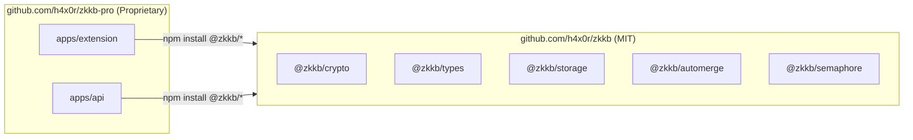

# Private Repository Setup (zkkb-pro)

This guide explains how to set up the private `zkkb-pro` repository that contains the proprietary ZKKB application.

## Architecture



## Step 1: Create Private Repository

```bash
# Create the private repo directory
mkdir zkkb-pro
cd zkkb-pro
git init

# Create on GitHub (private)
gh repo create h4x0r/zkkb-pro --private --source=. --push
```

## Step 2: Initialize Project Structure

```bash
mkdir -p apps/{extension,api}
```

### Root package.json

```json
{
  "name": "zkkb-pro",
  "version": "0.0.0",
  "private": true,
  "license": "UNLICENSED",
  "scripts": {
    "dev": "pnpm -r dev",
    "build": "pnpm -r build",
    "test": "pnpm -r test"
  },
  "devDependencies": {
    "typescript": "^5.9.3"
  }
}
```

### pnpm-workspace.yaml

```yaml
packages:
  - 'apps/*'
```

## Step 3: Chrome Extension App

### apps/extension/package.json

```json
{
  "name": "zkkb-extension",
  "version": "0.1.0",
  "private": true,
  "license": "UNLICENSED",
  "scripts": {
    "dev": "vite build --watch",
    "build": "vite build",
    "test": "vitest"
  },
  "dependencies": {
    "@zkkb/crypto": "^0.1.0",
    "@zkkb/types": "^0.1.0",
    "@zkkb/storage": "^0.1.0",
    "@zkkb/automerge": "^0.1.0",
    "@zkkb/semaphore": "^0.1.0",
    "preact": "^10.28.0",
    "@preact/signals": "^2.5.1"
  },
  "devDependencies": {
    "@preact/preset-vite": "^2.10.2",
    "@types/chrome": "^0.1.32",
    "tailwindcss": "^4.1.17",
    "vite": "^7.2.7"
  }
}
```

### Directory Structure

```
apps/extension/
├── src/
│   ├── background/
│   │   └── service-worker.ts
│   ├── sidepanel/
│   │   ├── index.html
│   │   ├── main.tsx
│   │   ├── App.tsx
│   │   ├── components/
│   │   │   ├── Board.tsx
│   │   │   ├── Column.tsx
│   │   │   ├── Card.tsx
│   │   │   └── ...
│   │   └── styles.css
│   └── lib/
│       ├── sync/          # Pro feature: cloud sync
│       │   └── manager.ts
│       └── api/           # Pro feature: API client
│           └── client.ts
├── public/
│   └── icons/
├── manifest.json
├── vite.config.ts
└── package.json
```

## Step 4: Backend API App

### apps/api/package.json

```json
{
  "name": "zkkb-api",
  "version": "0.1.0",
  "private": true,
  "license": "UNLICENSED",
  "scripts": {
    "dev": "wrangler dev",
    "deploy": "wrangler deploy"
  },
  "dependencies": {
    "@zkkb/types": "^0.1.0",
    "@semaphore-protocol/proof": "^4.0.0"
  },
  "devDependencies": {
    "@cloudflare/workers-types": "^4.0.0",
    "wrangler": "^3.0.0"
  }
}
```

### Directory Structure

```
apps/api/
├── src/
│   ├── index.ts
│   ├── routes/
│   │   ├── auth.ts
│   │   ├── boards.ts
│   │   └── attachments.ts
│   ├── middleware/
│   │   ├── session.ts
│   │   └── zkproof.ts
│   └── durable-objects/
│       └── BoardSync.ts
├── schema.sql
├── wrangler.toml
└── package.json
```

## Step 5: Install Dependencies

```bash
cd zkkb-pro

# Install pnpm if needed
npm install -g pnpm

# Install all dependencies
pnpm install
```

The `@zkkb/*` packages will be installed from npm (once published) or you can link them locally during development:

```bash
# For local development, link the public packages
cd ../zkkb
pnpm build

cd ../zkkb-pro
pnpm link ../zkkb/packages/crypto
pnpm link ../zkkb/packages/types
pnpm link ../zkkb/packages/storage
pnpm link ../zkkb/packages/automerge
pnpm link ../zkkb/packages/semaphore
```

## Step 6: Development Workflow

```bash
# Terminal 1: Watch public packages
cd zkkb
pnpm dev

# Terminal 2: Run extension dev server
cd zkkb-pro
pnpm --filter zkkb-extension dev

# Terminal 3: Run API dev server
cd zkkb-pro
pnpm --filter zkkb-api dev
```

## Proprietary License

Create `LICENSE` in zkkb-pro:

```
PROPRIETARY LICENSE

Copyright (c) 2024 [Your Company]

All rights reserved.

This software and associated documentation files (the "Software") are
proprietary and confidential. Unauthorized copying, modification,
distribution, or use of this Software, via any medium, is strictly
prohibited.

The Software is licensed, not sold. This license does not grant you any
rights to use the Software except as expressly set forth in a separate
written agreement with [Your Company].

For licensing inquiries, contact: [your-email]
```

## CI/CD

### GitHub Actions for Private Repo

```yaml
# .github/workflows/ci.yml
name: CI

on: [push, pull_request]

jobs:
  build:
    runs-on: ubuntu-latest
    steps:
      - uses: actions/checkout@v4

      - uses: pnpm/action-setup@v2
        with:
          version: 8

      - uses: actions/setup-node@v4
        with:
          node-version: 20
          cache: pnpm

      - run: pnpm install
      - run: pnpm build
      - run: pnpm test
```

## Deployment

### Extension

```bash
cd apps/extension
pnpm build
# Creates dist/ folder
# Upload to Chrome Web Store
```

### API

```bash
cd apps/api
pnpm deploy
# Deploys to Cloudflare Workers
```

## Summary

| Repository | License | Contents | Visibility |
|------------|---------|----------|------------|
| `zkkb` | MIT | Crypto, types, storage, automerge, semaphore | Public |
| `zkkb-pro` | Proprietary | Extension app, API backend, sync service | Private |

The private repo imports from the public packages via npm. This gives you:
- **Auditability**: Core crypto is open source and auditable
- **Community**: Others can build on your packages
- **Protection**: Pro features are truly private
- **Monetization**: Clear separation for freemium model
