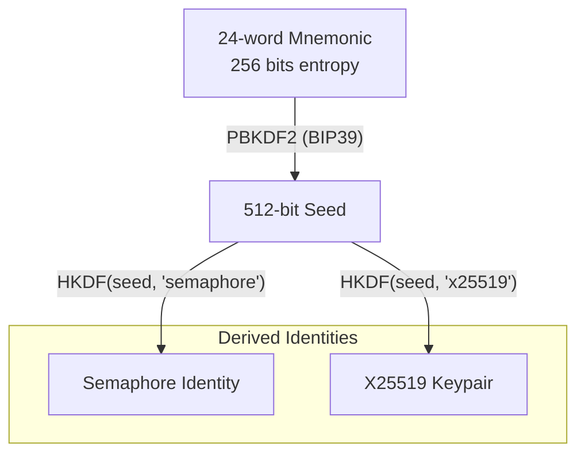
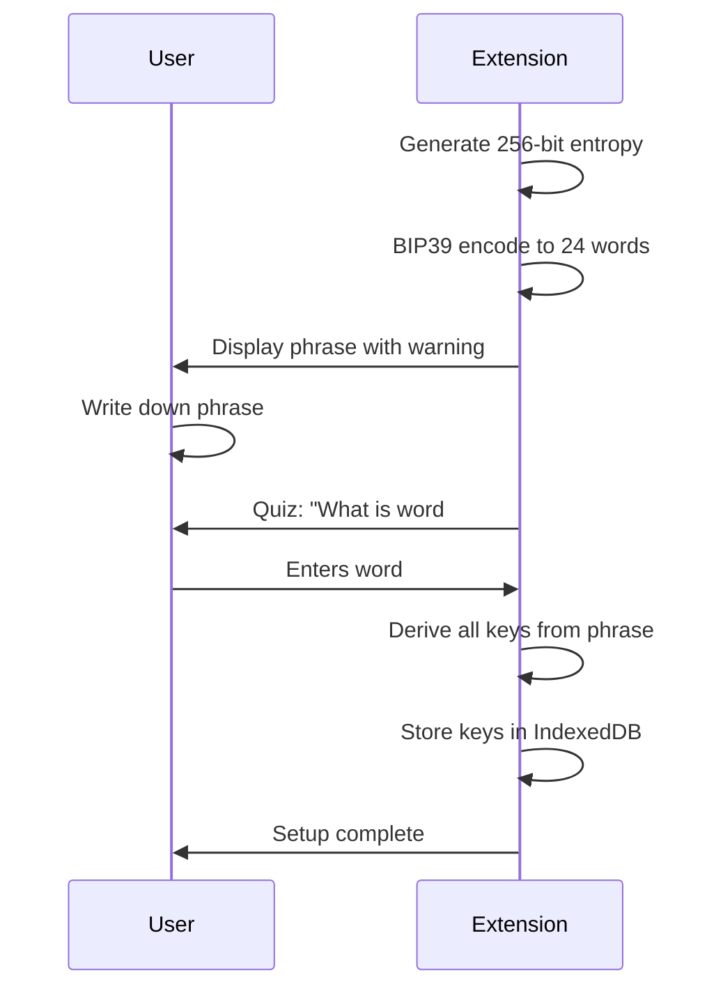

# ADR-001: E2EE with BIP39 Recovery Phrase

## Status

Accepted

## Context

Chatham requires end-to-end encryption where the server cannot access user data. Users need a way to:
1. Generate cryptographic keys
2. Recover their identity on new devices
3. Not manage complex passwords

Traditional approaches have tradeoffs:

| Approach | Pros | Cons |
|----------|------|------|
| Password-based | Familiar UX | Weak entropy, phishing risk, server storage |
| Hardware keys | Strong security | Hardware cost, loss risk, complexity |
| OAuth | No password | Identity provider sees everything |
| Recovery phrase | Strong entropy, portable | User must safeguard phrase |

## Decision

We will use **BIP39 24-word mnemonic phrases** for identity generation and recovery.

### Key Derivation Path

1. **Recovery phrase**: BIP39 generates 24 words from 256 bits of entropy
2. **Seed**: `PBKDF2(phrase, "mnemonic" + passphrase)` produces 512-bit seed
3. **Semaphore identity**: `HKDF(seed[0:32], "chatham-semaphore")` for ZK proofs
4. **X25519 keypair**: `HKDF(seed[0:32], "chatham-x25519")` for key wrapping

### Cryptographic Choices

| Component | Algorithm | Rationale |
|-----------|-----------|-----------|
| Phrase generation | BIP39 | Industry standard, 256 bits entropy |
| Seed derivation | PBKDF2-HMAC-SHA512 | BIP39 spec, 2048 rounds |
| Key derivation | HKDF-SHA256 | Modern, secure, deterministic |
| Encryption | AES-256-GCM | AEAD, browser native |
| Key exchange | X25519 | Small keys, fast, secure |

## Consequences

### Positive

- **Strong entropy**: 256 bits vs typical 40-bit passwords
- **No server storage**: Keys never leave client
- **Deterministic recovery**: Same phrase = same keys on any device
- **Phishing resistant**: No password to steal
- **Portable**: Works across browsers/devices

### Negative

- **User responsibility**: Lost phrase = lost data (no recovery)
- **Backup UX**: Must educate users to save phrase securely
- **No reset**: Cannot "forget password" and recover via email
- **Offline phrase**: Must display phrase offline-capable (no network dependency)

### Mitigations

1. **Phrase display**: Large font, numbered words, copy button
2. **Confirmation**: Require user to verify 3 random words
3. **Warning**: Clear "save this, only way to recover" messaging
4. **Optional storage**: Let user opt-in to storing encrypted phrase locally

## Alternatives Considered

### Password + Server-side Key Escrow

Rejected because:
- Server can access keys
- Defeats E2EE promise
- Single point of compromise

### Hardware Security Keys (WebAuthn)

Rejected because:
- Requires hardware purchase
- Lost key = lost data
- Complex cross-device story

### Social Recovery (Shamir's Secret Sharing)

Deferred for future consideration:
- Good UX for recovery
- Requires trusted contacts
- Complex implementation
- Could be added as optional feature

## References

- [BIP39 Specification](https://github.com/bitcoin/bips/blob/master/bip-0039.mediawiki)
- [HKDF RFC 5869](https://datatracker.ietf.org/doc/html/rfc5869)
- [Web Crypto API](https://developer.mozilla.org/en-US/docs/Web/API/Web_Crypto_API)
