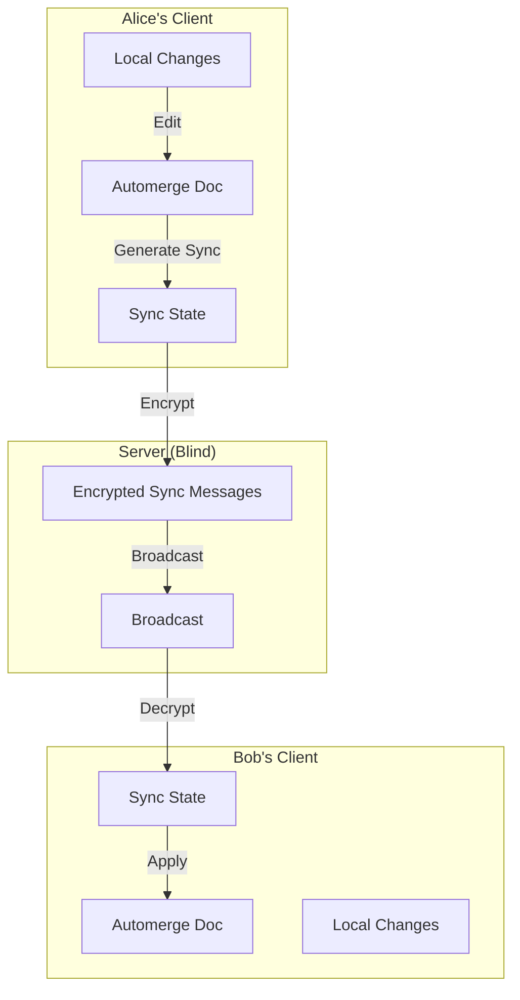
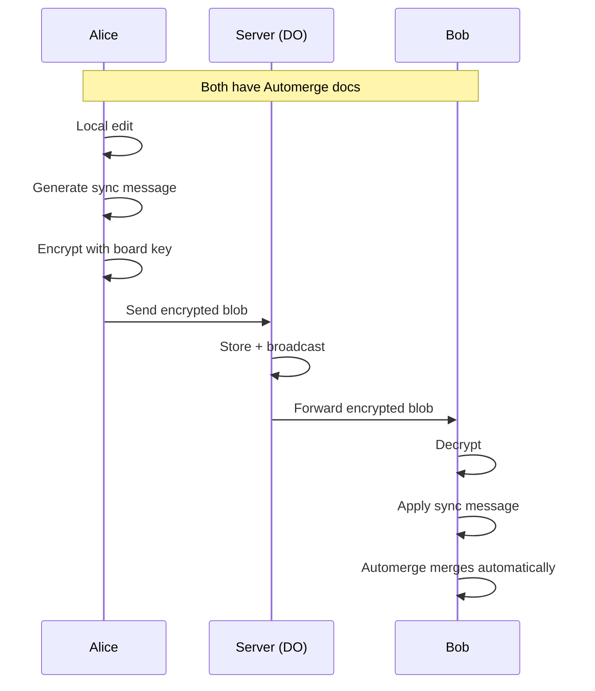
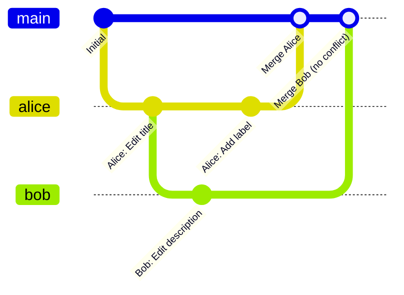

# ADR-003: Automerge CRDT for Real-time Sync

## Status

Accepted

## Context

ZKKB needs real-time collaboration where multiple users can edit the same board simultaneously. The system must handle:
- Concurrent edits to the same card
- Network partitions (offline editing)
- Merge without conflicts
- E2EE compatibility (server cannot resolve conflicts)

Traditional approaches have limitations:

| Approach | Issue with E2EE |
|----------|-----------------|
| Operational Transform (OT) | Requires server to transform operations |
| Last-write-wins | Data loss on concurrent edits |
| Locking | Poor UX, offline incompatible |
| Manual merge | Terrible UX |

## Decision

We will use **Automerge** for conflict-free real-time synchronization.



### Why Automerge

Automerge is a CRDT (Conflict-free Replicated Data Type) that:
1. **Merges automatically**: Any two states can merge without conflicts
2. **Works offline**: Changes accumulate locally, sync when online
3. **Preserves intent**: Concurrent edits both appear (no silent overwrites)
4. **Encrypts well**: Sync messages are opaque binary blobs

### Data Model

```typescript
// Automerge document structure
interface BoardContent {
  name: string;
  members: { [commitment: string]: Member };
  columns: Column[];
  cards: { [id: string]: Card };
}

// Using Automerge's Text for collaborative editing
interface Card {
  id: string;
  title: string;        // Automerge.Text for char-by-char sync
  description: string;  // Automerge.Text
  // ... other fields
}
```

### Sync Protocol



## Consequences

### Positive

- **Conflict-free**: Concurrent edits merge deterministically
- **Offline-first**: Full functionality without network
- **E2EE compatible**: Server sees only encrypted blobs
- **History**: Built-in change tracking and undo
- **Efficient sync**: Only sends deltas, not full document

### Negative

- **Document size**: Grows with history (mitigated by compaction)
- **Bundle size**: ~500KB WASM
- **Learning curve**: CRDT semantics differ from traditional state
- **No schema validation**: Invalid states possible if not careful

### Performance Characteristics

| Operation | Time Complexity | Notes |
|-----------|-----------------|-------|
| Local edit | O(1) | Append to local log |
| Generate sync | O(changes) | Proportional to pending changes |
| Apply sync | O(changes) | Proportional to incoming changes |
| Full merge | O(n log n) | Rare, only on major divergence |

### Merge Semantics



**Example scenarios:**

| Scenario | Alice Does | Bob Does | Result |
|----------|-----------|----------|--------|
| Different fields | Edit title | Edit description | Both changes kept |
| Same field | "Hello" → "Hello World" | "Hello" → "Hello!" | "Hello World!" (both suffixes) |
| Delete vs edit | Delete card | Edit card | Card deleted (delete wins) |
| Move card | Move to column A | Move to column B | Last-writer-wins on columnId |

## Implementation Details

### Document Creation

```typescript
import * as Automerge from '@automerge/automerge'

const doc = Automerge.from<BoardContent>({
  name: 'My Board',
  members: {},
  columns: [
    { id: uuid(), title: 'To Do', position: 'a' },
    { id: uuid(), title: 'In Progress', position: 'n' },
    { id: uuid(), title: 'Done', position: 'z' },
  ],
  cards: {},
})
```

### Making Changes

```typescript
const newDoc = Automerge.change(doc, 'Add card', (d) => {
  d.cards[cardId] = {
    id: cardId,
    columnId: columnId,
    title: 'New Task',
    description: '',
    // ...
  }
})
```

### Sync Flow

```typescript
// Generate sync message
const [newDoc, syncMessage] = Automerge.generateSyncMessage(doc, syncState)

// Encrypt and send
const encrypted = await encrypt(boardKey, syncMessage)
websocket.send(encrypted)

// Receive and apply
const decrypted = await decrypt(boardKey, received)
const [mergedDoc, newSyncState] = Automerge.receiveSyncMessage(doc, syncState, decrypted)
```

### Offline Queue

```typescript
// Store pending changes in IndexedDB
interface PendingChange {
  boardId: string;
  syncMessage: Uint8Array;  // Encrypted
  timestamp: number;
}

// On reconnect
for (const pending of await db.getAll('pendingChanges')) {
  websocket.send(pending.syncMessage)
  await db.delete('pendingChanges', pending.id)
}
```

## Alternatives Considered

### Yjs

Similar CRDT library. Rejected because:
- Less mature TypeScript support
- Automerge has better tooling for our use case
- Automerge's sync protocol is simpler

### Operational Transform (Google Docs style)

Rejected because:
- Requires server to understand operations
- Incompatible with E2EE (server must transform)
- Complex implementation

### Event Sourcing

Rejected because:
- Requires conflict resolution logic
- Server needs to understand events
- More complex than CRDT

### Custom CRDT

Rejected because:
- Reinventing the wheel
- High risk of subtle bugs
- Automerge is battle-tested

## References

- [Automerge](https://automerge.org/)
- [Automerge GitHub](https://github.com/automerge/automerge)
- [CRDT Paper](https://hal.inria.fr/inria-00555588/document)
- [Martin Kleppmann's talks](https://martin.kleppmann.com/)
