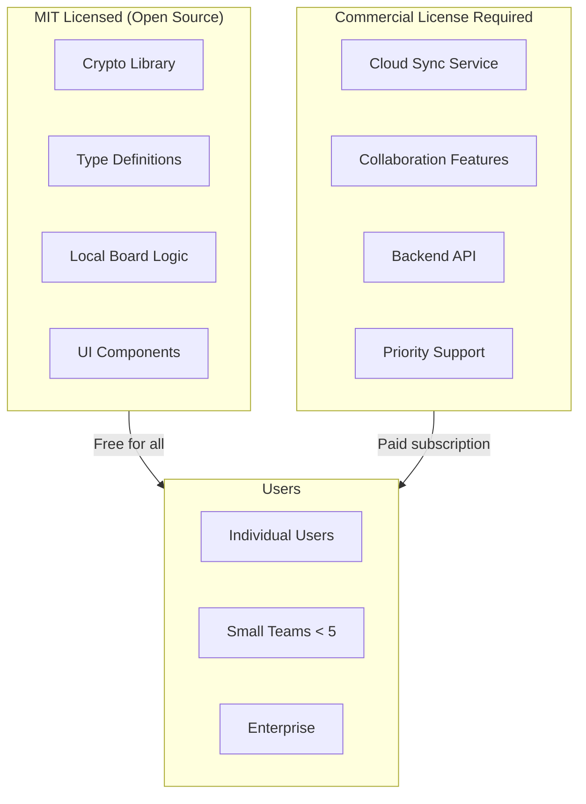
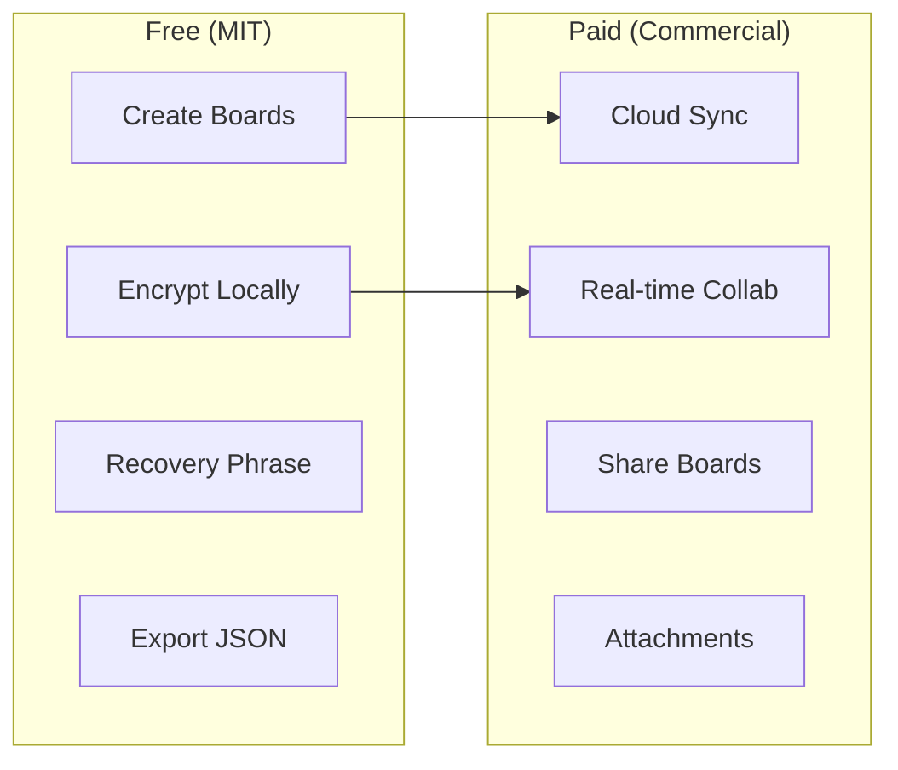
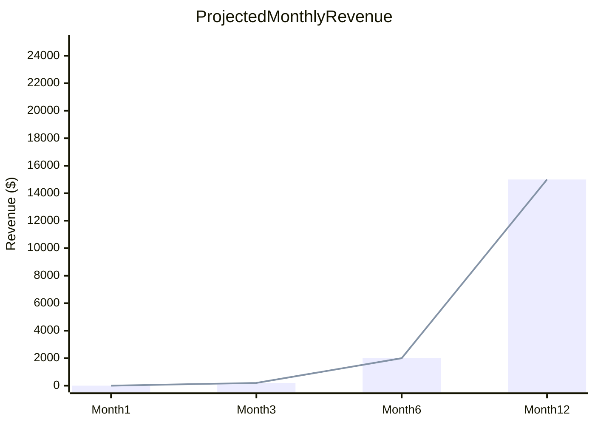

# ADR-005: Dual Licensing for Freemium Model

## Status

Accepted

## Context

ZKKB needs a licensing strategy that:
1. Allows open source community usage
2. Protects against competitors forking and competing
3. Enables monetization through paid features
4. Keeps core cryptographic code auditable

Common approaches:

| License | Open Source | Commercial Protection | Complexity |
|---------|-------------|----------------------|------------|
| MIT | Yes | None | Low |
| AGPL | Yes | Forces open source | Medium |
| BSL | Delayed open | Production restrictions | Medium |
| Proprietary | No | Full | Low |
| Dual License | Partial | Feature-based | Medium |

## Decision

We will use **MIT License with Commercial Addendum** (Dual Licensing).



### License Structure

**MIT License applies to:**
- `src/lib/crypto/*` - All cryptographic code
- `src/lib/automerge/*` - CRDT operations
- `src/lib/storage/*` - Local IndexedDB storage
- `src/types/*` - TypeScript interfaces
- `src/sidepanel/components/*` - UI components

**Commercial License required for:**
- `src/lib/sync/*` - Cloud synchronization
- `src/lib/api/*` - Backend API client
- `api/*` - Cloudflare Workers backend
- Production deployment with >5 users or >$1M revenue

### Threshold Definition

| Criterion | Free Use | Commercial Required |
|-----------|----------|-------------------|
| Users per organization | ≤5 | >5 |
| Annual revenue | ≤$1M | >$1M |
| Feature set | Local only | Cloud sync/collab |

## Consequences

### Positive

- **Auditability**: Core crypto remains MIT, anyone can audit
- **Community growth**: Free for individuals and small teams
- **Clear monetization**: Cloud features require payment
- **Competitive protection**: Can't just clone and compete
- **Compliance friendly**: MIT core satisfies most requirements

### Negative

- **Enforcement complexity**: Hard to verify revenue thresholds
- **Split codebase**: Must maintain clear boundaries
- **Perception risk**: Some may see as "not truly open source"
- **License confusion**: Users must understand which parts are which

### Feature Boundary



### Enforcement Strategy

1. **Honor system**: Most users self-select correctly
2. **Feature gating**: Cloud features require account with billing
3. **Terms of Service**: Legal recourse if violated
4. **Enterprise sales**: Direct contact for large orgs

## Implementation

### File Headers

```typescript
// src/lib/crypto/aes.ts
/**
 * ZKKB Cryptographic Library
 *
 * SPDX-License-Identifier: MIT
 *
 * This file is part of ZKKB's core cryptographic library,
 * available under the MIT License.
 */
```

```typescript
// src/lib/sync/manager.ts
/**
 * ZKKB Sync Manager
 *
 * SPDX-License-Identifier: LicenseRef-ZKKB-Commercial
 *
 * This file requires a commercial license for production use.
 * See LICENSE for details.
 */
```

### Directory Structure

```
zkkb/
├── src/
│   ├── lib/
│   │   ├── crypto/      # MIT
│   │   ├── automerge/   # MIT
│   │   ├── storage/     # MIT
│   │   ├── sync/        # Commercial
│   │   └── api/         # Commercial
│   ├── types/           # MIT
│   └── sidepanel/       # MIT (components), Commercial (sync integration)
├── api/                 # Commercial (backend)
├── LICENSE              # MIT + Commercial Addendum
└── LICENSE-COMMERCIAL   # Full commercial terms
```

### Feature Flag Implementation

```typescript
// src/lib/features.ts (MIT)
export interface FeatureFlags {
  cloudSync: boolean
  collaboration: boolean
  attachments: boolean
}

export function getFeatures(license: 'free' | 'pro'): FeatureFlags {
  if (license === 'pro') {
    return {
      cloudSync: true,
      collaboration: true,
      attachments: true,
    }
  }
  return {
    cloudSync: false,
    collaboration: false,
    attachments: false,
  }
}
```

## Alternatives Considered

### Pure MIT

Rejected because:
- No protection against competitors
- No sustainable business model
- Relies entirely on donations/goodwill

### AGPL

Rejected because:
- Scares enterprise users
- Doesn't directly enable monetization
- Forces open source on all integrators

### BSL (Business Source License)

Considered viable, rejected because:
- Time-delayed open source is confusing
- "Production use" restriction is vague
- Our feature-based split is clearer

### Full Proprietary

Rejected because:
- No community trust
- Crypto code not auditable
- Limits adoption

### Open Core (Separate Repos)

Rejected because:
- Maintenance overhead
- Confusing for contributors
- Code duplication

## Pricing Strategy

| Tier | Price | Features |
|------|-------|----------|
| Free | $0 | Local boards, encryption, recovery |
| Pro | $8/user/mo | + Cloud sync, collaboration, attachments |
| Enterprise | Custom | + SSO, audit logs, SLA, support |

### Revenue Projections



## References

- [Open Core vs Open Source](https://www.oreilly.com/library/view/open-source-for/9781449333706/)
- [FSL License](https://fsl.software/)
- [Fair Source](https://fair.io/)
- [MongoDB License Change](https://www.mongodb.com/licensing/server-side-public-license)
