# README Diagram Improvement Design

**Date:** 2025-12-11
**Status:** Approved
**Goal:** Replace HTML table diagrams with proper visualization tools (hybrid Mermaid + Excalidraw approach)

---

## Problem

Current README uses HTML tables to represent complex architecture flows and system diagrams. While tables work for comparisons, they don't effectively communicate:
- Data flow and system architecture
- Sequential processes (authentication, collaboration)
- Visual separation of security boundaries

## Solution: Hybrid Diagram Approach

Use the right tool for each diagram type:

### Hero Diagrams (Excalidraw → PNG)
**Why Excalidraw:**
- Complete visual control (positioning, styling)
- Hand-drawn aesthetic matches privacy-first brand
- Polished, professional look for critical diagrams

**Which diagrams:**
1. **Security Model** - The technical centerpiece showing end-to-end encryption flow
2. **Chatham House Model** - The unique privacy architecture (two separate domains)

### Living Diagrams (Mermaid)
**Why Mermaid:**
- Text-based, version-controlled
- Native GitHub rendering (no build step)
- Easy to update as features evolve
- Zero maintenance overhead

**Which diagrams:**
1. **Zero-Knowledge Authentication** - Sequence diagram of ZK proof flow
2. **Real-time Collaboration Flow** - Flowchart of CRDT merge process

### Keep as HTML Tables
**Which diagrams:**
1. **What The Server Sees** - Data visibility comparison table
2. **Traditional vs Chatham** - Side-by-side comparison
3. **Test Coverage** - Simple data table
4. **Two Separate Domains** - Comparison table works well

---

## Design Details

### 1. Security Model (Excalidraw Hero)

**Visual Style:**
- Hand-drawn aesthetic with rough, sketchy lines
- Color palette:
  - Blue tones for client-side (trusted zone)
  - Gray for internet boundary
  - Orange/warm tones for cloud services
- Clear visual hierarchy with size and color

**Layout (Top to Bottom Flow):**

**Zone 1: YOUR DEVICE** (blue background)
```
[Recovery Phrase]  →  [Derive Seed]  →  [Identity Keys]
   24 words BIP-39      PBKDF2 100k         • publicKey
                                            • privateKey
                                            • zkIdentity
                         ↓
              [Board Encryption]
              AES-256-GCM
              Your Data → Encrypted Blob
```

**Zone 2: INTERNET** (gray barrier)
```
═══════════════════════════════════
   🔒 ENCRYPTED TRANSPORT (TLS)
═══════════════════════════════════
```

**Zone 3: CLOUDFLARE EDGE** (orange background)
```
[D1]              [R2]              [Durable Objects]
Metadata          Blobs             WebSocket Sync
• user IDs        • encrypted       • broadcast
• board IDs         board data      • presence
• merkle roots    • encrypted files
```

**Key Elements:**
- Big arrows showing data flow direction
- Icons: 🔑 for keys, 🔒 for encryption, ☁️ for cloud
- Callout box: "Server CANNOT see: card content, names, files"

---

### 2. Chatham House Model (Excalidraw Hero)

**Visual Style:**
- Two distinct zones separated by bold visual barrier
- Color palette:
  - Left side (Email Domain): Purple/lavender tones
  - Right side (Commitment Domain): Green/teal tones
  - Center barrier: Bold red/warning color

**Layout (Side-by-Side Split):**

**Left: EMAIL DOMAIN** (purple box)
```
📧 EMAIL DOMAIN
(Billing Only)

✓ Your email
✓ Your tier (free/pro)
✓ Payment info
✓ Stripe customer ID

Server knows:
"alice@example.com
 is a Pro customer"
```

**Center: THE BARRIER** (bold separation)
```
║ ⚠️ NO LINK ║
║  BETWEEN   ║
║  DOMAINS   ║
║            ║
║ Only your  ║
║ device     ║
║ knows both ║
```

**Right: COMMITMENT DOMAIN** (green box)
```
🔐 COMMITMENT DOMAIN
(Boards & Activity)

✓ Your boards
✓ Your membership
✓ Your activity
✓ Encrypted content

Server knows:
"Commitment 0x1a2b
 owns 3 boards"
(not whose!)
```

**Key Elements:**
- Broken chain icon 🔗⛓️‍💥 in barrier
- Arrow from user's device pointing to both sides
- Emphasis: Server sees TWO SEPARATE FACTS but cannot link them

---

### 3. Zero-Knowledge Authentication (Mermaid)

**Diagram Type:** Sequence Diagram

**Mermaid Code:**


```mermaid
sequenceDiagram
    participant C as 👤 Client
    participant S as 🖥️ Server

    Note over C,S: Traditional Auth
    C->>S: "I am Alice"
    S->>C: "Welcome" (server knows you)

    Note over C,S: Chatham (Zero-Knowledge)
    C->>S: ZK Proof: "I'm in the group,<br/>but won't say which member"
    S->>C: "Verified" (server doesn't know who)
```

**Why Sequence Diagram:**
- Shows back-and-forth communication clearly
- Built-in "Note" sections separate the two approaches
- Actor labels support emoji

---

### 4. Real-time Collaboration Flow (Mermaid)

**Diagram Type:** Flowchart

**Mermaid Code:**


```mermaid
flowchart TB
    A[👩 Alice offline<br/>📝 Add card 'Design v2']
    B[👨 Bob online<br/>➡️ Move card to 'Done']
    C[👩‍💼 Carol<br/>✏️ Edit card description]

    CRDT[⚡ Automerge CRDT<br/>merges changes automatically]

    Final[✅ FINAL STATE<br/>• Alice's card appears<br/>• Bob's move preserved<br/>• Carol's edit included<br/>• No conflicts!]

    A --> CRDT
    B --> CRDT
    C --> CRDT
    CRDT --> Final

    style Final fill:#e8f5e9
```

**Why Flowchart:**
- Shows parallel actions converging
- Custom styling for success state (green background)
- Emoji support for visual interest

---

## File Organization

### Directory Structure
```
chatham/
├── docs/
│   ├── images/
│   │   ├── security-model.png          # Excalidraw export (2x resolution)
│   │   ├── security-model.excalidraw   # Source file (editable)
│   │   ├── chatham-house-model.png     # Excalidraw export (2x resolution)
│   │   └── chatham-house-model.excalidraw # Source file (editable)
│   └── adr/
└── README.md                            # Mermaid diagrams inline
```

### Workflow

**For Hero Diagrams (Excalidraw):**
1. Create/edit in [excalidraw.com](https://excalidraw.com)
2. Save as `.excalidraw` file in `docs/images/`
3. Export as PNG with 2x resolution (for retina displays)
4. Commit both `.excalidraw` source + `.png` export
5. Embed in README: ``

**For Living Diagrams (Mermaid):**
1. Write Mermaid syntax directly in README.md
2. Wrap in ` ```mermaid ` code blocks
3. GitHub renders automatically
4. Test locally with VS Code Mermaid preview extension

**Maintenance:**
- Excalidraw sources live in repo → anyone can edit and re-export
- Mermaid updates instantly (just edit the text)
- Use 2x export resolution so diagrams look sharp on retina displays

---

## Implementation Plan

### Phase 1: Setup
- [ ] Create `docs/images/` directory
- [ ] Install VS Code Mermaid preview extension (optional, for local testing)

### Phase 2: Hero Diagrams (Excalidraw)
- [ ] Create Security Model diagram in Excalidraw
  - [ ] Design layout following spec above
  - [ ] Save `.excalidraw` source
  - [ ] Export PNG at 2x resolution
- [ ] Create Chatham House Model diagram in Excalidraw
  - [ ] Design layout following spec above
  - [ ] Save `.excalidraw` source
  - [ ] Export PNG at 2x resolution

### Phase 3: Living Diagrams (Mermaid)
- [ ] Replace "Zero-Knowledge Authentication" HTML table with Mermaid sequence diagram
- [ ] Replace "Real-time Collaboration Flow" HTML table with Mermaid flowchart
- [ ] Test rendering on GitHub (push to branch and preview)

### Phase 4: README Updates
- [ ] Replace Security Model HTML table with Excalidraw PNG embed
- [ ] Replace Chatham House Model HTML table with Excalidraw PNG embed
- [ ] Keep comparison tables as HTML (they work well)
- [ ] Update any broken links or formatting

### Phase 5: Testing & Refinement
- [ ] Verify all diagrams render correctly on GitHub
- [ ] Check mobile responsiveness
- [ ] Ensure PNGs are high-res and readable
- [ ] Get feedback and iterate if needed

---

## Success Criteria

- ✅ Architecture flows are visually clear and professional
- ✅ Hero diagrams have polished, hand-drawn aesthetic
- ✅ Living diagrams are easy to update (text-based)
- ✅ All diagrams render natively on GitHub
- ✅ Source files committed for future edits
- ✅ No external dependencies or build steps required

---

## Trade-offs Accepted

**Excalidraw:**
- ✅ Beautiful, polished visuals
- ✅ Complete control over layout
- ⚠️ Binary files (harder to review in git diffs)
- ⚠️ Need to re-export on every change

**Mermaid:**
- ✅ Text-based, easy to update
- ✅ Native GitHub rendering
- ⚠️ Limited visual styling
- ⚠️ Auto-generated layout (less control)

**Decision:** Worth the trade-offs for a professional, maintainable README.

---

## References

- [Mermaid vs D2 Comparison](https://aaronjbecker.com/posts/mermaid-vs-d2-comparing-text-to-diagram-tools/)
- [Text to Diagram Tools Comparison 2025](https://text-to-diagram.com/?example=text)
- [Create Diagrams Using ChatGPT, Mermaid, and Excalidraw](https://spin.atomicobject.com/diagrams-mermaid-excalidraw/)
- [Excalidraw](https://excalidraw.com)
- [Mermaid Documentation](https://mermaid.js.org/)
